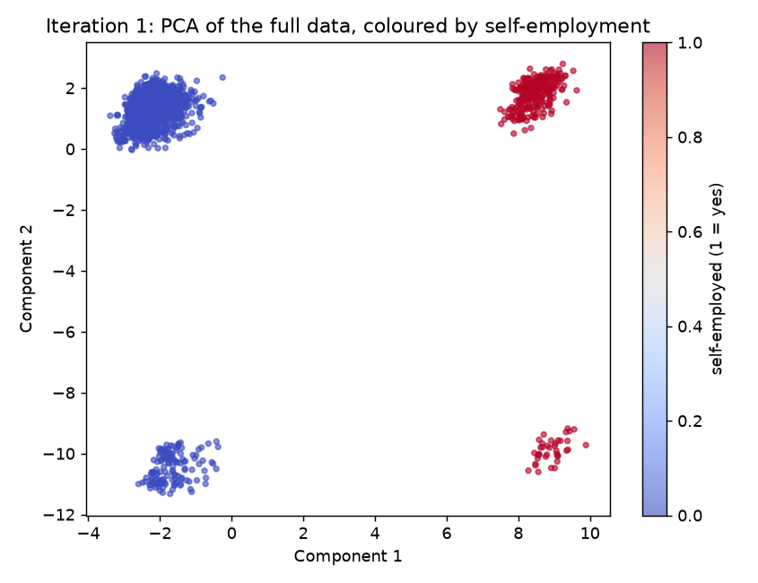
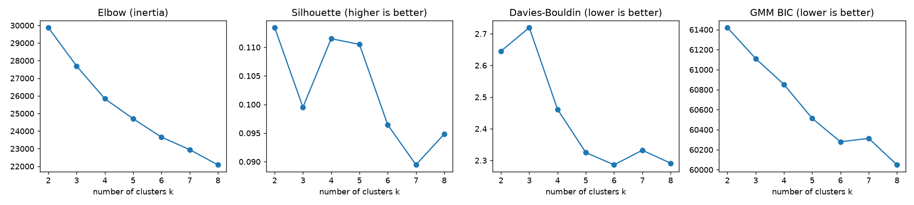
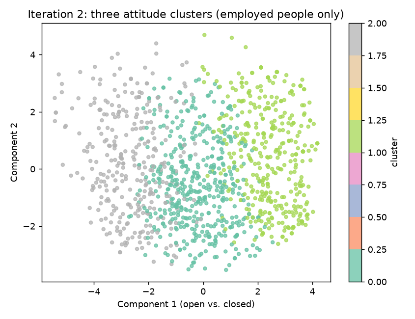
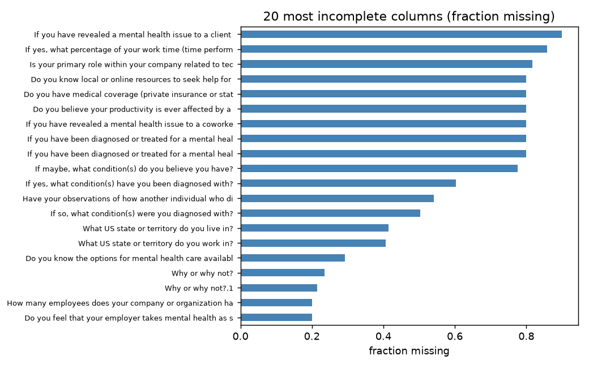
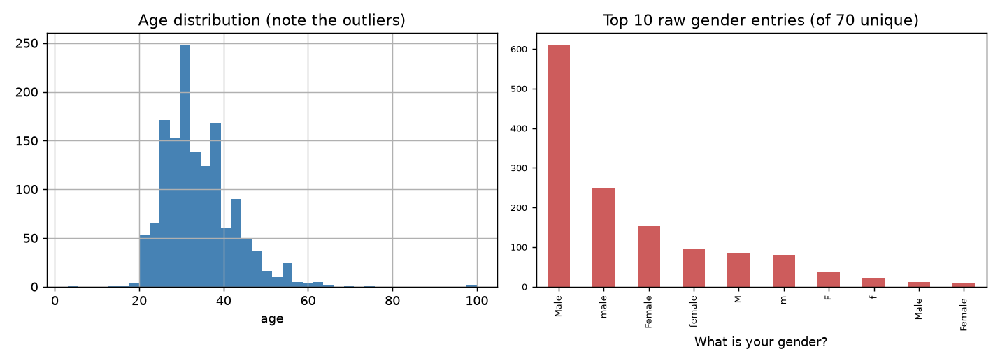

# Mental Health in Tech 2016 — Unsupervised Learning Case Study

**Author:** YALCIN Alp Ege
**Matriculation No.:** 42308653
**Course:** DLBDSMLUSL01 — Machine Learning: Unsupervised Learning and Feature Engineering

Case study for IU International University of Applied Sciences, Task 1:
*Mental Health in Technology-related Jobs*.

Goal: turn the messy OSMI 2016 survey (1,433 respondents × 63 questions) into
something HR can act on — clusters of similar respondents, low-dimensional
visualisations, per-cluster profiles, and programme leverage points.

## Workflow

| Step | Script | What it does | Report chapter |
|---|---|---|---|
| 1. Explore | `00_exploration.py` | Descriptive stats, missingness, dirty columns | 2 |
| 2. Preprocess | `01_preprocessing.py` | Clean, engineer & encode → numeric matrix | 4 |
| 3. Quick first try | `02_first_iteration.py` | Simple PCA + k-Means — fails informatively (rediscovers survey routing) | 5 |
| 4. Step back & improve | `03_refined_iteration.py` | Employed-only, 12 attitude questions, k-Means vs GMM, 4 selection metrics | 6–8 |

## Result

Three attitude groups among the ~1,146 employed respondents:

- **Open & supported (~380)** — 89% comfortable talking to their supervisor, 86% expect no negative consequences; the internal model of what works.
- **Uncertain (~452)** — dominated by "maybe" and "I don't know"; uninformed rather than afraid, and the cheapest group to move.
- **Closed & fearful (~314)** — 83% not comfortable disclosing, 59% expect negative consequences; affected but silent.

### Iteration 1 — the simple attempt that rediscovers survey structure


### Iteration 2 — choosing the number of clusters


### Iteration 2 — the three attitude clusters


### Data exploration



## Choosing the number of clusters

Four diagnostics over k = 2–8. Silhouette mildly favours k = 2, but three
groups are balanced and each tells a distinct, actionable story, so k = 3 was
chosen (interpretability over the metric optimum).

```
 k | inertia | silhouette | DaviesBouldin | BIC
 2 |   29878 |      0.113 |          2.65 | 61421
 3 |   27695 |      0.100 |          2.72 | 61111
 4 |   25838 |      0.111 |          2.46 | 60853
 5 |   24704 |      0.111 |          2.32 | 60514
 6 |   23661 |      0.096 |          2.29 | 60279
 7 |   22949 |      0.089 |          2.33 | 60314
 8 |   22085 |      0.095 |          2.29 | 60049
```

## Run it

```bash
python3 -m venv .venv && source .venv/bin/activate
pip install -r requirements.txt:
#   task1_data/mental-heath-in-tech-2016_20161114.csv
python3 00_exploration.py
python3 01_preprocessing.py
python3 02_first_iteration.py
python3 03_refined_iteration.py
```

## Data

OSMI Mental Health in Tech Survey 2016 —
https://www.kaggle.com/osmi/mental-health-in-tech-2016
